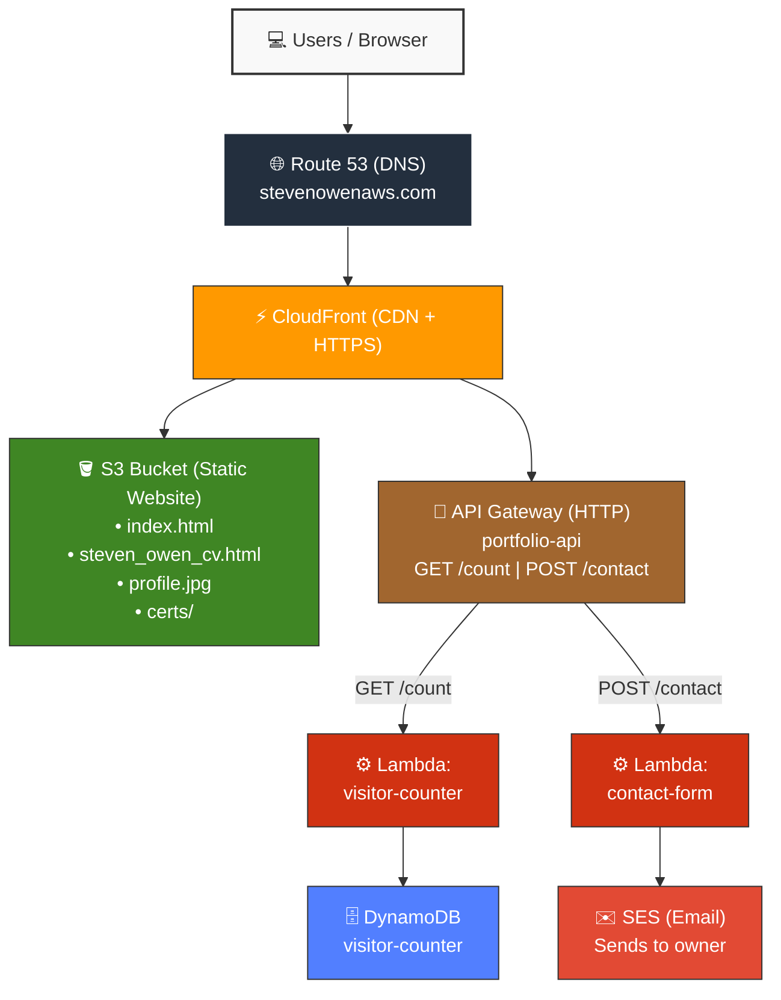

# Cloud Resume - Portfolio Website

A serverless portfolio website built entirely on AWS, demonstrating cloud engineering skills including Infrastructure as Code, CI/CD, and security best practices.

🌐 **Live site:** [stevenowenaws.com](https://stevenowenaws.com)

---

## Architecture



---

## CI/CD Pipeline

```
┌──────────────┐     ┌───────────────────┐     ┌─────────────┐     ┌────────────┐
│  Developer   │────▶│  GitHub Actions   │────▶│  S3 Sync    │────▶│ CloudFront │
│  git push    │     │  (OIDC Auth)      │     │  Upload     │     │ Invalidate │
└──────────────┘     └───────────────────┘     └─────────────┘     └────────────┘
```

- Push to `main` branch triggers automatic deployment
- Uses OIDC identity federation (no stored access keys)
- Syncs files to S3 and invalidates CloudFront cache

---

## Security Measures

- **CORS** locked to `stevenowenaws.com` only
- **API throttling** — rate limited to prevent abuse
- **IAM least privilege** — Lambda roles scoped to specific actions
- **OIDC** — no long-lived credentials for CI/CD
- **Honeypot field** — bot protection on contact form
- **Input validation** — client and server-side length limits
- **HTTPS** enforced via CloudFront

---

## Tech Stack

| Service | Purpose |
|---------|---------|
| S3 | Static website hosting |
| CloudFront | CDN, HTTPS, caching |
| Route 53 | DNS management |
| API Gateway | HTTP API with throttling |
| Lambda | Serverless compute (Python) |
| DynamoDB | Visitor counter storage |
| SES | Contact form email delivery |
| IAM | Least privilege access control |
| GitHub Actions | CI/CD with OIDC |
| CloudFormation | Infrastructure as Code |

---

## Files

| File | Description |
|------|-------------|
| `index.html` | Portfolio homepage |
| `steven_owen_cv.html` | CV/Resume page |
| `portfolio-infrastructure.yaml` | CloudFormation template |
| `.github/workflows/deploy.yml` | CI/CD pipeline |

---

Built by Steven Owen as part of the AWS Cloud Resume Challenge.
